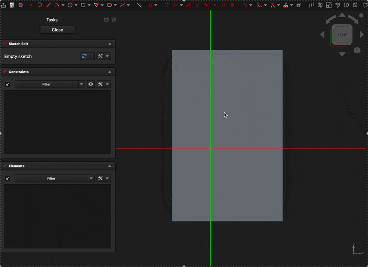

# Blueprints - FreeCAD Addon for rapid sketching

> [!IMPORTANT]
> This addon is still in development.
> The basic functionaly it there, but it still needs lots of usability tweaking.
---

Reduce repetetive work by loading pre-defined sketches from community collections.

For example, add a USB-C port (hole) to your electronics case in seconds. 

### Features

**Define your own sketches** with tools you are already familiar with: FreeCAD.
Blueprints are just sketches – loaded from another FreeCAD file.
You can fully constraint your sketch relative to the axis origin (e.g., distance to PCB).
All constraints are copied to the new destination (incl. computed and named constraints).
The blueprint copy uses an artificial axis to allow translation and rotation around the origin.

If a blueprint contains only one sketch, it is loaded right away.
If the file contains multiple sketches, a popup will ask you which sketch to load (second window in the video above).

#### Tips for creators

- Switch to the `Part` workbench to create a sketch without a body.
- Add a descriptive `desc` parameter to your sketch if you use multiple sketches per document.
- Fully-constraint your sketch to the origin.
  Underconstraints needs to be resolved each time someone inserts a blueprint.
- Remember, users can still edit the sketch after it is imported.
- External references are prohibited
- Before publishing, try to load your design and verify everything works as expected.

### Roadmap

- [ ] Documentation
	- instructions on how to create blueprints
	- documentation / description for the addon store
	- proper dev documentation (this Readme++)
- [ ] Improve blueprint insert workflow
	- cursor icon for blueprint placement
	- where to show "allow rotation" option/checkbox?
	- check if there are other expressions than in-sketch refs
	- thumbnail preview of the sketch prior to import
- [ ] Allow user to (easily) create new blueprints
	- shortcut to create new document in user-collection
	- create empty sketch via `Part` (avoids a body object)
	- usage instructions (`desc` property, fully constrain to origin, ...)
- [ ] Preferences page
	- manage location of user-collection
	- manage subscriptions (with update button?, we need versions)
- [ ] Allow bp-creators to define variables?
	- either by Sketch properties or via `VarSet`
	- how are multiple instances handled?
- [ ] General improvements
	- Qt string translations
- [ ] Community managed content
	- add mechanism to subscribe to community managed blueprints
	- either via git (not installed everywhere) or bundled with addon (less updates)
	- At the very least, have a markdown with links to great sources
